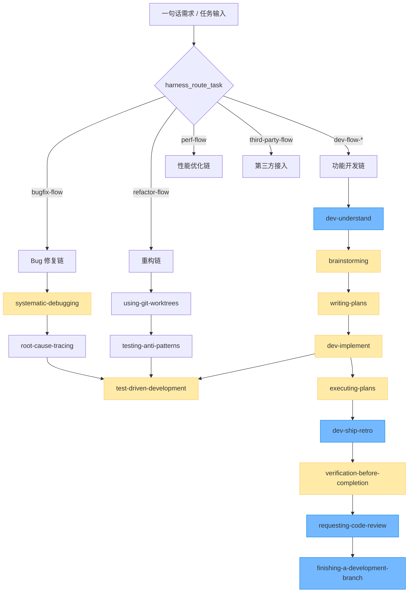

# Skills Index · 内置 Skill 决策树与频率分布

> 这份索引让 AI / 工程师**在 30 秒内挑出**该用哪个 skill；并明确每个 skill 的使用频次、依赖关系与适用阶段。
>
> 路由器 `harness_route_task` 已根据一句话需求自动挑 skill，本文件用于**人工启动**和**多 skill 组合**两种场景。

---

## 1. 整体地图



🟡 黄色：每日 / 每个需求都用
🔵 蓝色：每周 / 关键阶段用

---

## 2. 按使用频次分档

### 2.1 P0 · 每次任务都过一遍（≥ 80% 命中）

| skill | 用途 | 触发场景 |
|---|---|---|
| `ai-efficiency` | 省 token / 高效操作 | 任何 ≥ 3 步任务 |
| `brainstorming` | 探索需求边界 | 实现前 |
| `writing-plans` | 出明文计划 | > 3 步任务实现前 |
| `executing-plans` | 按计划推进 | 拿到计划后 |
| `test-driven-development` | 测试先行 | 任何新功能 / bug 修复 |
| `verification-before-completion` | 提交前自检 | 收尾 |

### 2.2 P1 · 关键阶段用（≥ 30% 命中）

| skill | 用途 | 触发场景 |
|---|---|---|
| `dev-flow` | 开发组合拳路由器 | 接到需求时 |
| `dev-flow-oneliner-*` | 小需求执行 | 简单功能 |
| `dev-flow-doc-*` | PRD 完整执行 | 大需求 |
| `dev-flow-proto-*` | 原型项目移植 | 有参考实现 |
| `dev-flow-full` | 完整全流程 | 全栈复杂 |
| `dev-understand` | 项目勘察阶段 | 首次接入项目 / 大改前 |
| `dev-implement` | 实现阶段 | 编码主战 |
| `dev-ship-retro` | 上线 + 复盘 | 收尾 |
| `bugfix-flow` | bug 修复全流程 | 报错 / 500 / 崩溃 |
| `refactor-flow` | 行为零变更重构 | 整理代码 |
| `perf-flow` | 性能优化 | 慢 / 优化 / benchmark |
| `third-party-flow` | 第三方接入 | 接 SDK / 对接 / OAuth |
| `systematic-debugging` | 根因排查 | bug 修复中 |
| `requesting-code-review` | 申请审查 | 实现完成 |
| `receiving-code-review` | 处理审查反馈 | 收到 review |

### 2.3 P2 · 专题工具（按需）

| skill | 用途 |
|---|---|
| `root-cause-tracing` | 调用栈反向追根因 |
| `defense-in-depth` | 多层校验设计 |
| `condition-based-waiting` | 解决 flaky 测试 |
| `subagent-driven-development` | 委派 subagent |
| `dispatching-parallel-agents` | 并行 agent 协作 |
| `testing-anti-patterns` | 测试反模式审查 |
| `using-git-worktrees` | git worktree 隔离 |
| `finishing-a-development-branch` | 分支收尾 |
| `find-skills` | 找 skill 自身 |
| `sharing-skills` | 贡献 skill 上游 |
| `writing-skills` | 写新 skill |
| `testing-skills-with-subagents` | skill TDD |
| `using-superpowers` | 工作流元规则 |
| `wechat-ai-article` | 微信公众号 AI 文章（**非工程治理**，niche）|

---

## 3. 按场景速查

### 3.1 接到一句话需求

```
1. harness_route_task task="..."
2. 看 skill / modifiers / forced_upgrade
3. harness_load_skill name=<skill>
4. （≥ 3 步）writing-plans → 用户拍板 → executing-plans
5. 实现 → test-driven-development
6. verification-before-completion → requesting-code-review
```

### 3.2 接到 bug 报告

```
1. systematic-debugging（4 阶段法：调查→分析→假设→实现）
2. root-cause-tracing（如需向上找根因）
3. test-driven-development（先写复现失败测试再修）
4. verification-before-completion
```

### 3.3 接到「代码很慢」

```
1. perf-flow（先 benchmark 立基线）
2. 不要凭感觉优化，每改一次跑一次微基准
3. verification-before-completion
```

### 3.4 接到「接入 X 服务」

```
1. third-party-flow
2. 强制 Vendor 适配层（业务层禁直接调 SDK）
3. 沙箱跑通 → 切真实
4. test-driven-development（mock + 真实双重测试）
```

### 3.5 接到「整理这堆代码」

```
1. refactor-flow（先有覆盖待重构区域的测试网）
2. using-git-worktrees（必要时隔离实验）
3. testing-anti-patterns 自检
4. 分步原子 commit，每步绿测
```

### 3.6 长任务（已 6 轮以上还没收敛）

```
1. ai-efficiency §6（卡住时切模式）
2. subagent-driven-development 委派
3. writing-plans 倒回重新拉齐
```

---

## 4. 多 skill 组合模板

| 场景 | 组合链 |
|---|---|
| 全栈大需求 | `dev-flow-full` → `dev-understand` → `brainstorming` → `writing-plans` → `executing-plans` → `dev-implement` → `tdd` → `verify` → `dev-ship-retro` |
| 后端 PRD 实现 | `dev-flow-doc-be` → `writing-plans` → `tdd` → `verify` → `requesting-code-review` |
| 前端原型移植 | `dev-flow-proto-fe` → `dev-understand` → `tdd` → `verify` |
| Bug 修复 | `bugfix-flow` → `systematic-debugging` → `root-cause-tracing` → `tdd` → `verify` |
| 性能优化 | `perf-flow` → 微基准 → `verify` |
| 第三方接入 | `third-party-flow` → Vendor 适配层 → `tdd` → `verify` |

---

## 5. 依赖关系约定

每个 SKILL.md 头部 frontmatter 都应该带：

```yaml
---
name: dev-flow-oneliner-fe
version: 0.1.0
applies_to: [all]              # 所适用的 stack
depends_on: [brainstorming]    # 进入前必读的 skill
related: [dev-flow-doc-fe]     # 强制升级 / 相关 skill
priority: P1                   # P0/P1/P2，对应 §2 分档
usage_frequency: weekly        # daily/weekly/monthly
---
```

如某 skill 还未补齐 frontmatter，按下列规则推断：

- 名字含 `dev-flow-*` → P1 / weekly / `[all]`
- 名字含 `*-flow` 且非 `dev-flow*` → P1 / weekly / `[all]`
- 含 `tdd / debugging / verification / brainstorming / writing-plans / executing-plans / ai-efficiency` → P0 / daily / `[all]`
- 其它 → P2 / monthly

---

## 6. 加载策略

| 场景 | 加载方式 |
|---|---|
| 主会话 / 高频 skill | 通过 MCP URI `harness://skills/<name>` 引用，**不要**复制粘贴正文 |
| 一次性使用 | `harness_load_skill name=<name>` 拉取后即丢 |
| 多 skill 组合 | 依次 load；如总长 > 4000 字符，**只 load skill 名 + 关键步骤**，正文交给 subagent |
| 离线 / no-MCP 环境 | 直接 read `assets/skills/<name>/SKILL.md` |

---

## 7. 元规则

- skill 是**建议**而非硬规则；硬规则在 `assets/rules/`，spec 设计层在 `assets/spec/`
- 当 skill 与 rule 冲突时：**rule 优先**，详见 `assets/spec/PRIORITY_HIERARCHY.md`
- 新增 skill 走 `writing-skills` → `sharing-skills` 流程
