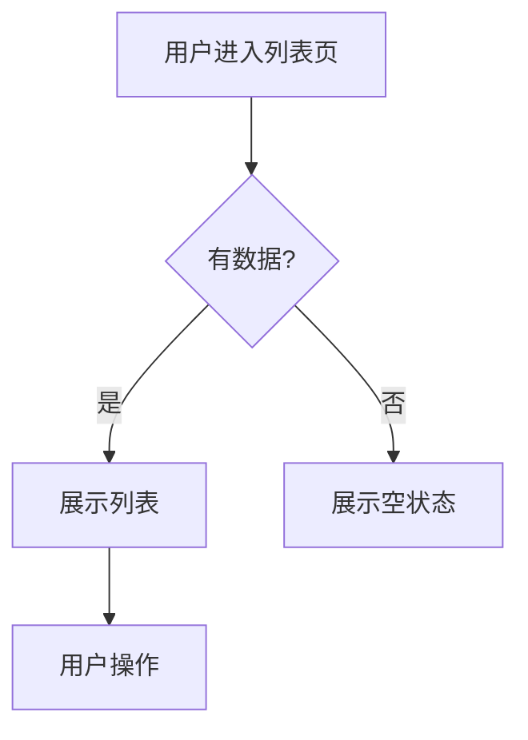

# 业务流程文档

> ⚠️ 本文档**禁止包含具体框架代码**。用业务语言描述，便于跨技术栈复用。

## 1. 涉及角色

| 角色 | 职责 | 权限范围 |
|------|------|---------|
| 例：管理员 | 审核供应商 | admin 后台全部 |

## 2. 核心实体

| 实体 | 业务含义 | 关键属性 |
|------|---------|---------|
| 例：供应商 | 平台合作的货源方 | 名称、联系方式、状态、审核记录 |

## 3. 用户故事

### Story 1: [故事标题]
**作为** [角色]，**我希望** [操作]，**以便** [目的]。

**前置条件**：
- ...

**操作步骤**：
1. 用户进入 [页面]，看到 [展示内容]（截图见 `screenshots/01.png`）
2. 用户点击 [按钮]，触发 [行为]
3. 系统返回 [结果]

**验收标准**：
- ✅ 成功路径：...
- ✅ 失败路径：...
- ✅ 边界场景：...

## 4. 流程图

## 5. 业务规则

| 规则编号 | 规则描述 | 处理方式 |
|---------|---------|---------|
| BR-001 | 同一供应商不能重复审核 | 二次提交时返回幂等结果 |
| BR-002 | 审核通过后不可撤销 | UI 隐藏撤销按钮 |

## 6. 截图索引

放在 `screenshots/` 子目录：
- 01-list-page.png 列表页初始状态
- 02-detail-page.png 详情页
- 03-action-success.png 操作成功
- 04-empty-state.png 空状态
- 05-error-state.png 错误状态
