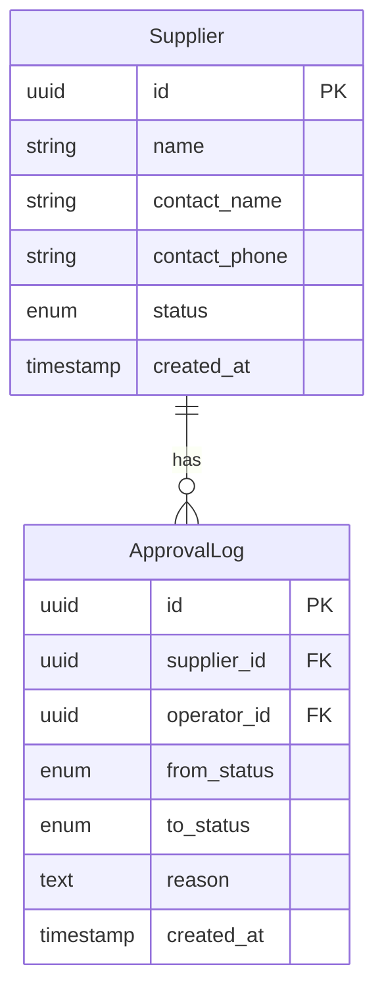

# 数据模型文档

> ⚠️ 用通用 ER 描述，**不要绑定具体 ORM**。实际建表/迁移由 B 项目的开发者按其规范实现。

## 实体清单

| 实体 | 业务含义 | 大致体量 |
|------|---------|---------|
| Supplier | 供应商 | 万级 |
| ApprovalLog | 审核日志 | 十万级 |

---

## 实体：Supplier（供应商）

**业务定义**：平台合作的货源方。

**字段**：

| 字段名 | 类型 | 必填 | 唯一 | 索引 | 说明 |
|--------|------|------|------|------|------|
| id | UUID/BIGINT | ✅ | ✅ | PK | 主键 |
| name | string(100) | ✅ | ✅ | ✅ | 供应商名称 |
| contact_name | string(50) | ✅ | - | - | 联系人姓名 |
| contact_phone | string(20) | ✅ | - | ✅ | 联系电话 |
| status | enum | ✅ | - | ✅ | pending/approved/rejected |
| created_at | timestamp | ✅ | - | ✅ | 创建时间 |
| updated_at | timestamp | ✅ | - | - | 更新时间 |
| deleted_at | timestamp | - | - | ✅ | 软删除时间 |

**枚举值 - status**：
| 值 | 含义 | 流转规则 |
|----|------|---------|
| pending | 待审核 | 初始状态 |
| approved | 已通过 | 不可逆 |
| rejected | 已拒绝 | 可重新提交回 pending |

**校验规则**：
- name 长度 2-100，禁止特殊字符
- contact_phone 必须符合手机号格式
- 同 name + contact_phone 组合唯一

---

## 实体：ApprovalLog（审核日志）

**业务定义**：记录供应商状态变更历史。

**字段**：

| 字段名 | 类型 | 必填 | 索引 | 说明 |
|--------|------|------|------|------|
| id | UUID/BIGINT | ✅ | PK | |
| supplier_id | UUID/BIGINT | ✅ | ✅ | 外键 → Supplier.id |
| operator_id | UUID/BIGINT | ✅ | ✅ | 操作者 |
| from_status | enum | ✅ | - | 变更前状态 |
| to_status | enum | ✅ | - | 变更后状态 |
| reason | text | - | - | 拒绝原因 |
| created_at | timestamp | ✅ | ✅ | |

---

## 关系图

## 数据迁移注意事项

- [ ] 是否需要历史数据迁移？
- [ ] 是否影响现有索引？
- [ ] 是否需要灰度方案？
- [ ] 大表加字段是否需要在线 DDL 工具？
