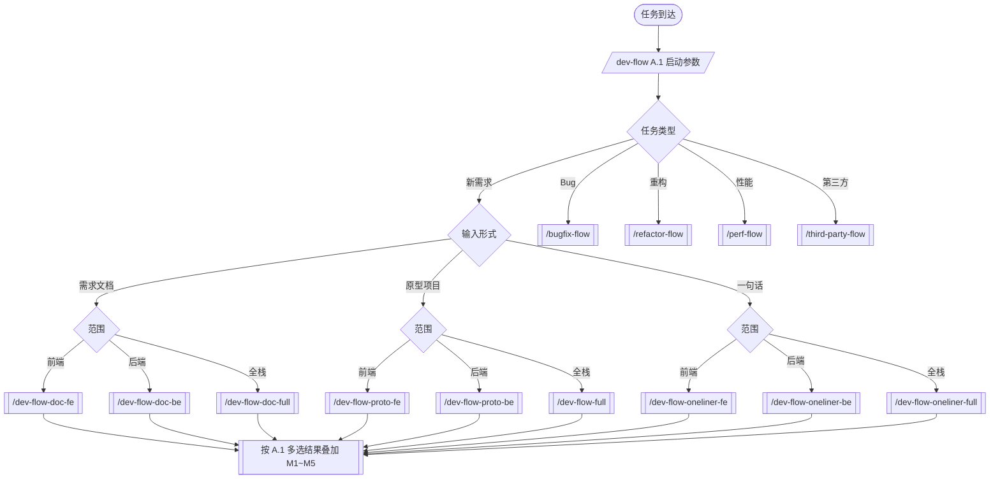

# dev-flow

> 本 skill 是开发组合拳的**唯一入口路由器**，自身不执行业务流程，只完成"问 → 写
> dispatch-context.json → 指示主 agent 调用对应子 skill"。所有规范、卡点、文档模板
> 见单一事实源 [_playbook.md](file:///c:/Users/Administrator/Projects/_requirements/_playbook.md)。

## 适用场景

- 用户抛来一个开发任务，但你不确定该走哪个流程
- 用户口头说"接需求 / 开始开发 / 组合拳"
- 任务涉及前端、后端、全栈、bug 修复、重构、性能、第三方接入中的任意一项

## 前置条件

无强制前置；建议在进入路由前先确认：
- `~/Projects/_requirements/` 目录存在
- 用户当前工作目录是项目根目录或可由 `move_agent_to_root` 切换

## 流程步骤

### 步骤 1 · 收集启动参数（A.1）

使用 `AskQuestion` 一次性收集（如用户消息已提供则对应项跳过）。

**问题 1 · 任务类型**

```text
prompt: "准备开始。请帮我快速定位任务类型："
options:
  - "新需求/新功能"
  - "修 Bug"
  - "重构/整理代码"
  - "性能优化"
  - "接入第三方服务"
```

**若选了"新需求"，追问 2-1 输入形式**

```text
prompt: "PM/用户给你的输入是什么形式？"
options:
  - "完整需求文档（PRD、飞书文档等）"
  - "PM 给了一个可运行的参考/原型项目"
  - "一句话模糊需求（比如'加个筛选'）"
```

**若选了"新需求"，追问 2-2 范围**

```text
prompt: "本次需要开发的范围？"
options:
  - "只前端"
  - "只后端"
  - "全栈（前后端都做）"
```

**问题 3 · 修饰符（多选）**

```text
prompt: "是否满足以下任一条件？（可多选）"
options:
  - "PM/设计师给了设计稿（Figma / 截图）"
  - "有 UI 但没有设计稿"
  - "这是一个全新项目（还没有代码仓库）"
  - "涉及数据库迁移（新表 / 改表 / 删字段）"
  - "只联调，不开发（两侧代码已存在，只需要把契约对起来）"
  - "以上都不是"
allow_multiple: true
```

**问题 4 · 需求名称**

```text
prompt: "给这次任务起个英文 kebab-case 名字（用于命名知识库目录）："
（自由输入；若用户跳过，由你根据任务摘要起，例：supplier-batch-approve）
```

### 步骤 2 · 决策表查找子 skill（A.2）

| 任务类型 | 输入形式 | 范围 | → 路由到子 skill | 代号 |
|---|---|---|---|---|
| 新需求 | 需求文档 | 前端 | `/dev-flow-doc-fe` | S1 |
| 新需求 | 需求文档 | 后端 | `/dev-flow-doc-be` | S2 |
| 新需求 | 需求文档 | 全栈 | `/dev-flow-doc-full` | S3 |
| 新需求 | 原型项目 | 前端 | `/dev-flow-proto-fe` | S4 |
| 新需求 | 原型项目 | 后端 | `/dev-flow-proto-be` | S5 |
| 新需求 | 原型项目 | 全栈 | `/dev-flow-full`（已存在） | S6 |
| 新需求 | 一句话 | 前端 | `/dev-flow-oneliner-fe` | S7 |
| 新需求 | 一句话 | 后端 | `/dev-flow-oneliner-be` | S8 |
| 新需求 | 一句话 | 全栈 | `/dev-flow-oneliner-full` | S9 |
| Bugfix | 任意 | 任意 | `/bugfix-flow` | X1 |
| 重构 | 任意 | 任意 | `/refactor-flow` | X2 |
| 性能优化 | 任意 | 任意 | `/perf-flow` | X3 |
| 第三方接入 | 任意 | 任意 | `/third-party-flow` | X4 |

修饰符 M1–M5 不替换路由，叠加传给子 skill：

| 多选项 | 修饰符 |
|---|---|
| 设计稿 | M1 |
| 有 UI 无设计稿 | M2 |
| 全新项目 | M3 |
| 数据库迁移 | M4 |
| 只联调 | M5 |

### 步骤 3 · 写 dispatch-context.json（A.4）

落盘到 `~/Projects/_requirements/[feature_name]/dispatch-context.json`：

```json
{
  "scenario": "S3",
  "child_skill": "/dev-flow-doc-full",
  "modifiers": ["M1", "M4"],
  "feature_name": "supplier-batch-approve",
  "inputs": {
    "prd_path": null,
    "prototype_path": null,
    "one_liner": null
  },
  "scope": "full-stack | frontend-only | backend-only | n/a",
  "target_project": "C:/Users/Administrator/Projects/b-project"
}
```

如目录尚不存在，先 `mkdir -p ~/Projects/_requirements/[feature_name]/`。

### 步骤 4 · 把控制权交给子 skill

输出一段明确指示给主 agent，例如：

> "已完成路由：场景 S3，子 skill 为 `/dev-flow-doc-full`，修饰符 M1+M4。参数已写入
> `~/Projects/_requirements/supplier-batch-approve/dispatch-context.json`。请调用
> `/dev-flow-doc-full` 接管后续流程，并在阶段 4 叠加 M4 的 MIGRATION_PLAN.md。"

到此父 skill 退出。

## 决策树（可视化）



## 错误处理

- 用户拒绝回答任意一个问题 → 不要假设，明确告知"无法路由，请补全信息"
- `feature_name` 重名（目录已存在）→ 询问"继续在已有目录工作 / 改名 / 取消"
- 路由表无匹配（不可能但兜底）→ 退化为 `/dev-flow-doc-full`，并在产出中标注"路由兜底"

## 产物清单

- `~/Projects/_requirements/[feature_name]/dispatch-context.json`
- `~/Projects/_requirements/[feature_name]/META.md`（先建空骨架，子 skill 会补全）
- 一段交给主 agent 的明确路由指示

## 支持的修饰符

不直接处理 M1–M5，仅记录到 `dispatch-context.json` 传给子 skill。详细 delta 见手册 Part D。

## 与其他 skill 的关系

- 路由后调用的 13 个子 skill：`/dev-flow-doc-fe`、`/dev-flow-doc-be`、`/dev-flow-doc-full`、
  `/dev-flow-proto-fe`、`/dev-flow-proto-be`、`/dev-flow-full`、`/dev-flow-oneliner-fe`、
  `/dev-flow-oneliner-be`、`/dev-flow-oneliner-full`、`/bugfix-flow`、`/refactor-flow`、
  `/perf-flow`、`/third-party-flow`
- 与"阶段切片型" skill 的关系：`/dev-understand`、`/dev-implement`、`/dev-ship-retro`
  按"阶段"切，本路由按"场景类型"切，互补；用户明确"只做某阶段"时优先匹配阶段切片型

## 附录

- 通用基座（横切原则、卡点模板、commit 规范、目录约定）：见 [_playbook.md](file:///c:/Users/Administrator/Projects/_requirements/_playbook.md) **Part B**
- 修饰符 M1–M5 详细 delta：见 [_playbook.md](file:///c:/Users/Administrator/Projects/_requirements/_playbook.md) **Part D**
- 共享文档模板（META / PRD / API_CONTRACT 等）：见 [_playbook.md](file:///c:/Users/Administrator/Projects/_requirements/_playbook.md) **Part E**
- 完整 skill 索引与维护契约：见 [_playbook.md](file:///c:/Users/Administrator/Projects/_requirements/_playbook.md) **Part F**
