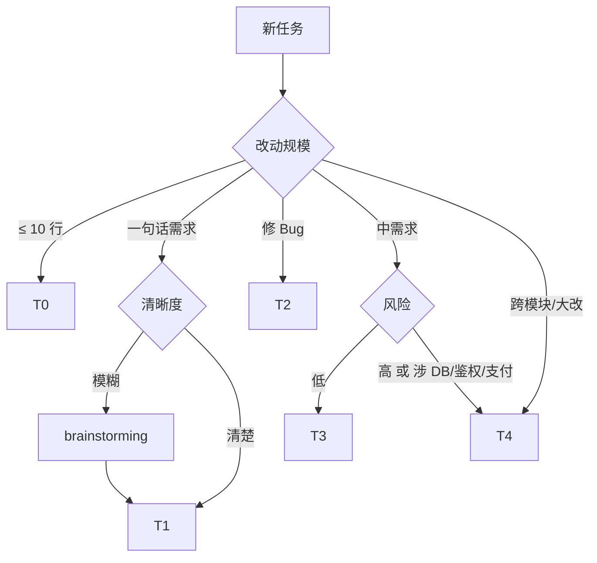
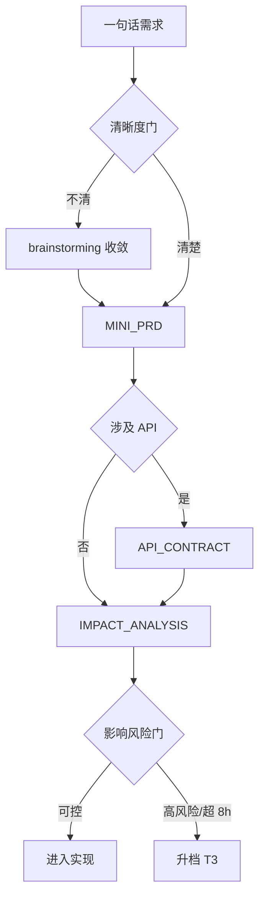
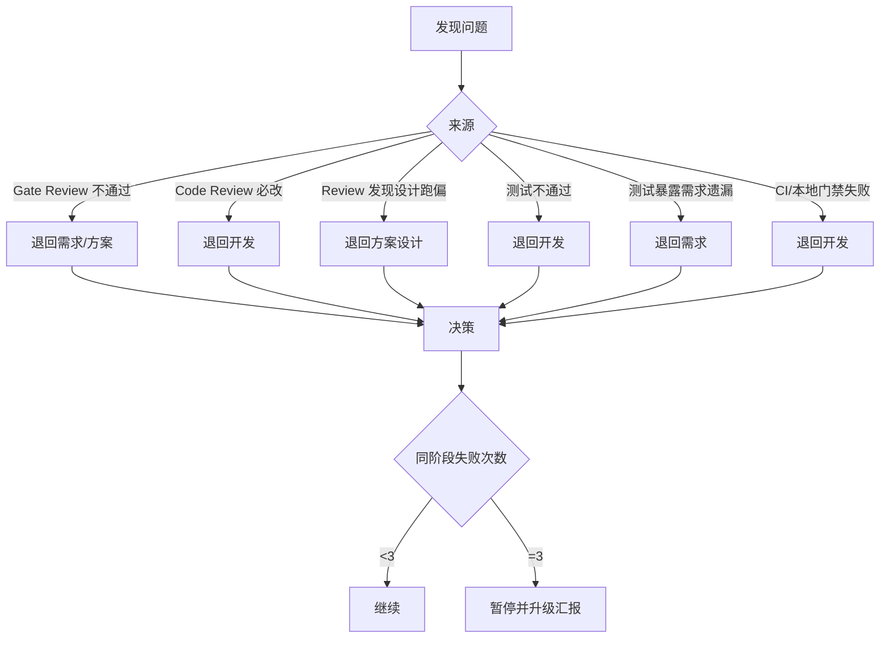

# 02 Process & Governance

> 需求分级、一句话两道门、Gate Review、回退路由、DoD、紧急通道、ADR、Harness 自演进。
>
> 这是 Harness 的核心。solo 模式必读 §1-§3。

---

## 1. 流程重量分级 [solo+]

### 1.1 5 档分级

| 档位 | 任务规模 | 必经流程 | 必出产物 |
| --- | --- | --- | --- |
| T0 | 十行内机械改动 | 直接实现 + 最小验证 | PR 描述 + `engineering-check` PASS |
| T1 | 一句话小需求 | 清晰度门 + 影响风险门 | MINI_PRD + IMPACT_ANALYSIS（必要时含 API_CONTRACT） |
| T2 | 小 Bug | 根因 + 失败测试 + 修复 | 根因记录 + 修复说明 + 回归测试 |
| T3 | 中等单模块需求 [small-team+] | 需求分析 + 方案 + Review + 测试 | feature-stages 01 / 02 / 05 / 06 + INDEX 更新 |
| T4 | 大需求 / 跨模块 / DB / 鉴权 / 支付 / 第三方 [mid-team+] | 完整阶段文档 + Gate Review + Code Review + QA + 发布 | feature-stages 01-06 全部 + ADR + 发布检查 |

### 1.2 升档触发

轻量流程发现 **影响扩大 / 风险升高 / 验收不清** 时立即升档，不允许"开干了再说"。

### 1.3 选型决策树



---

## 2. 一句话需求两道门 [solo+]

任何一句话需求都过两道门，防止小任务静默扩大。

### 2.1 门 1：清晰度门

判定项：

- [ ] 目标是否清晰
- [ ] 用户场景是否明确
- [ ] 验收标准是否可测
- [ ] 方案选项是否已收敛

任一不通过 -> 用 `brainstorming` skill 收敛 -> 产出 MINI_PRD（参考 [`templates/governance/feature-brief.md`](templates/governance/feature-brief.md)）

### 2.2 门 2：影响风险门

判定项：

- [ ] 是否涉及 DB / 鉴权 / 多租户
- [ ] 是否涉及缓存 / 搜索 / 异步
- [ ] 是否涉及支付 / 订单 / 钱包
- [ ] 是否涉及统计 / 导出 / 报表
- [ ] 是否影响公开 API / SDK 消费者
- [ ] 是否需要文档同步

任一为 yes -> 必出 IMPACT_ANALYSIS。出现 ≥ 2 项高风险或预估 > 8 工时 -> 升档到 T3。

### 2.3 流程图



---

## 3. ADR（Architecture Decision Record） [solo+]

### 3.1 何时必写 ADR

- 引入 / 替换 / 移除任何外部依赖（DB / MQ / 缓存 / 第三方 SDK）
- 修改架构分层 / 模块边界
- 选择影响 ≥ 1 季度的技术方案
- 涉及性能 / 可用性 / 安全的关键决策

### 3.2 文件位置

```
.harness/adr/
├── README.md                   ADR 总说明
├── 0000-template.md            模板
└── NNNN-<kebab-case-title>.md  实际 ADR，编号递增
```

### 3.3 状态流转

```
proposed -> accepted -> superseded by NNNN | deprecated
```

被取代时新 ADR 必须显式 `Supersedes 0017`，旧 ADR 不删除。

### 3.4 单人项目特例

solo 模式下 ADR 仍需写，但不强制 Reviewer 签字；自己拍板即可。

---

## 4. Gate Review [mid-team+]

### 4.1 触发条件

- 中大型需求（T3+）
- DB 变更 / 鉴权 / 多租户隔离 / 支付 / 第三方接入
- 跨模块改动 / 性能敏感改动
- 引入新依赖

### 4.2 输入与输出

- **输入**：需求分析、方案设计、API/DB 契约、影响分析
- **输出**：`.harness/features/<feature>/03_GATE_REVIEW.md`，结论 = `通过` / `有条件通过` / `不通过`
- **规则**：阻塞项不解决不进入开发

### 4.3 评审清单

| 维度 | 关键问题 |
| --- | --- |
| 需求 | 验收是否可测？是否覆盖反例？ |
| 架构 | 是否违反分层？是否引入新依赖？ |
| 数据 | 迁移可逆？大表 DDL 是否锁表？ |
| 安全 | 鉴权 / 隔离 / 输入校验 / 审计日志 |
| 性能 | 是否有热点 / N+1 / 大循环？ |
| 可测 | 单元 / 集成 / E2E 是否够 |
| 可观测 | 日志 / 指标 / Trace 是否够定位故障 |
| 回滚 | 出问题如何回？数据如何恢复？ |

---

## 5. 回退路由 [mid-team+]



核心原则：**发现问题的角色不直接修复自己发现的问题**，避免运动员兼裁判。

---

## 6. Definition of Done [solo+]

| 任务类型 | DoD |
| --- | --- |
| T0 / T1 一句话需求 | MINI_PRD + IMPACT_ANALYSIS（必要时 API_CONTRACT）+ 本地 PASS + PR 模板 + CI 通过 + INDEX 更新 |
| T2 Bug | 根因 + 失败测试 + 修复 + 回归 + 必要时 ADR / 规则更新 |
| T3 中需求 | 阶段文档 01 / 02 / 05 / 06 + Code Review 无必改 + 测试报告 PASS + 本地 + CI 通过 + INDEX |
| T4 大需求 [mid-team+] | 阶段文档 01-06 全 + Gate Review 通过 + Code Review 通过 + 测试报告 PASS + 发布检查 + canary 报告 + INDEX |
| 重构 | 边界说明 + 关键路径测试覆盖 + 行为零变化证据 + 本地 + CI 全过 |
| 性能 | 基线数据 + profile 证据 + 单变量优化对比 + 回归 + 文档更新 |

---

## 7. 紧急通道 [mid-team+]

### 7.1 触发

- 生产可用性事故
- 严重数据问题
- 严重安全漏洞
- 阻断主流程的 Bug

### 7.2 可跳过 / 不可跳过

| 项 | 可跳过 | 不可跳过 |
| --- | --- | --- |
| Gate Review | yes | - |
| 阶段文档 01-04 | yes | - |
| 完整 Code Review | yes | - |
| 本地 `engineering-check` | - | 必跑 |
| `mvn test` / 等价测试 | - | 必跑 |
| PR 模板填写 | - | 必填 |
| 值班 / 项目负责人书面批准 | - | 必有 |

### 7.3 事后补单

48 小时内补：
- 根因分析
- 最小修复说明
- 影响评估
- 回归测试
- 必要的 ADR

INDEX 标记 `hotfix-followup`。

### 7.4 红线

严禁把紧急通道当成日常路径。出现 ≥ 3 次 / 月触发 -> 季度复盘必查 -> 触发 [`ANTIPATTERNS.md`](ANTIPATTERNS.md) "紧急通道当成日常"。

---

## 8. 项目任务记忆 [small-team+]

参考 [`06-knowledge-and-memory.md`](06-knowledge-and-memory.md)。简述：

- `.harness/features/INDEX.md` 项目级看板
- `.harness/features/<feature>/01..06.md` 阶段文档（按 T 档启用对应数量）
- `.harness/features/_template/` 给空白模板

---

## 9. Harness 自演进 [mid-team+]

### 9.1 版本号

- 本规范包顶部维护版本号（`v0.x` -> `v1.0` 后用 SemVer）
- 重大调整 minor +1
- 不向后兼容的标签 / 字段调整 major +1

### 9.2 修改流程

任何流程 / 门禁 / 回退规则的修改：
1. 走 [`DEPRECATION_PATH.md`](DEPRECATION_PATH.md) 的 RFC
2. 必须新增 ADR 说明动机 / 影响 / 风险 / 回退方案
3. 灰度推行 ≥ 1 个迭代周期

### 9.3 季度复盘

每季度统计：
- 任务数量 / 各 T 档分布
- Gate Review 阻塞次数
- 回退路由触发次数
- 紧急通道使用次数
- CI 失败 Top 原因
- 被绕过 / 误报最多的规则

输出：下一版要新增 / 精简 / 调阈值的规则清单。

---

## 10. 与 .cursor/rules 的关系 [mid-team+]

- 能用 `engineering-check` 稳定检测 -> 优先迁到脚本，rules 只保留"为什么 + 示例"
- always-applied 的 rule 保持精简
- 新增 rule 前先问：能否机器化、是否高频违反、是否真不可自动检测；不能同时满足才作为常驻规则
