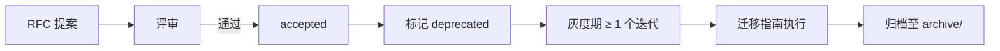

# Deprecation Path

> 规范条目的废弃 / 升级 / RFC 流程。防止规范越长越臃肿。
>
> solo / small-team：自己拍板修改即可，不必走 RFC。

---

## 1. 触发废弃 / 升级的信号

任意一个：
- 该条目被绕过 ≥ 3 次（同一团队 / 同一季度）
- 误报率 > 50%（机械检查）
- 拖慢交付（多次成为流程瓶颈）
- 不再适用（依赖技术 / 业务变化）
- 与新条目冲突
- 升档（如 L2 -> L3）需要更严约束

## 2. RFC 流程

### 2.1 提案

新增 / 修改 / 废弃任意条目，先在 `docs/engineering-harness-spec/rfcs/` 提 RFC：

```
docs/engineering-harness-spec/rfcs/
├── 0001-rfc-template.md
├── NNNN-<kebab-title>.md
```

模板字段：
- 提案人 / 日期
- 影响的条目
- 现状与问题
- 提案内容
- 影响评估（哪些项目受影响 / 工时估算）
- 反方意见
- 迁移指南

### 2.2 评审

| Mode | 评审者 |
| --- | --- |
| mid-team | ≥ 2 名 owner + 项目负责人 |
| org | RFC 委员会（含 platform / SRE / 安全） |

### 2.3 决策

```
proposed -> accepted | rejected | deferred
```

accepted 后进入「灰度推行期」。

## 3. 标准变更生命周期



### 3.1 灰度期

- 标记 `@deprecated` + 在文档与 `.harness/config.json` 提示
- 工具产出 WARN 而非 FAIL
- 持续 1 个迭代周期 + 季度复盘前不得移除

### 3.2 迁移指南

- 替代方案
- 自动迁移脚本（如有）
- 影响项目清单
- 截止日期

### 3.3 归档

- 旧条目移入 `docs/engineering-harness-spec/archive/`
- 不删除，保留供历史追溯
- 关联的 ADR 状态置 `superseded`

## 4. 紧急废弃 [org-only]

特殊情况：发现安全漏洞 / 严重错误。流程缩短到：

- 24 小时内决议
- 立刻标记 deprecated 且产出 FAIL
- 事后补 RFC + ADR

## 5. 与 ADR 的关系

| 类型 | 用途 | 文件位置 |
| --- | --- | --- |
| RFC | 规范变更提案 | `docs/engineering-harness-spec/rfcs/` |
| ADR | 项目内技术决策 | `.harness/adr/` |

RFC accepted 后必须配套写 ADR 记录决策。

## 6. 季度复盘清单

每季度复盘必看：

- [ ] 哪些条目被绕过？为什么？
- [ ] 哪些条目误报率高？
- [ ] 哪些条目拖慢交付？
- [ ] 是否有新增条目候选？
- [ ] DEPRECATION 灰度期到期的条目是否完成迁移？

输出：下季度 RFC 提案清单。

## 7. 反模式

- 没有 DEPRECATION_PATH 直接删条目 -> 历史项目无法追溯为什么不再做
- 标记 deprecated 后永远不移除 -> 规范越来越长
- 没有迁移指南就废弃 -> 项目无法落地新条目
- 把 RFC 当成"先合再讨论" -> 失去评审意义

## 8. 单人 / 小团队简化版

solo / small-team：
- 不必 RFC 提案，直接在 SSOT 文件加 `## 决策日志` 段，记录修改原因即可
- 如果项目有外部贡献者，建议保留 ADR 记录形式
