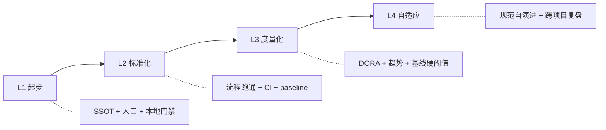

# Maturity Levels

> L1 起步 / L2 标准化 / L3 度量化 / L4 自适应。每档定义最低线 + 升档所需补的最小集。

## 1. 总览



## 2. L1 起步

**标志**：单 SSOT 存在 + 入口文档存在 + 本地门禁可跑。

| 模块 | 最低线 |
| --- | --- |
| People | 提交规范文档化（不强制 hooks） |
| Process | 流程分级文档存在 + 1 条 ADR |
| Quality | 本地 `engineering-check` 跑通 |
| Release | SemVer 选定（仅 Library/CLI） |
| Security | 密钥不入库（手动） |
| Knowledge | README + ADR 0001 |

**升 L2 所需补**：CI 上线 / baseline.json 建立 / features 任务板有 1 条真实记录 / 6 模块文档齐全。

## 3. L2 标准化

**标志**：流程跑通 + 门禁机械化 + 基线建立。

| 模块 | 最低线 |
| --- | --- |
| People | PR 模板 + 提交规范 hooks + Code Review 自检版 |
| Process | 6 模块文档齐 + features INDEX 至少 1 条真实记录 |
| Quality | CI 跑过 + baseline.json + 测试覆盖 |
| Release | CHANGELOG + 发布检查清单 |
| Security | 密钥扫描 hook + SCA 周报 |
| Knowledge | 关键 ADR + 阶段文档跑过 1 次完整闭环 |

**升 L3 所需补**：DORA 四指标采集 / perf 在线对比 / 覆盖率硬阈值 / SLO（若 Backend）/ Onboarding 30/60/90 上线。

## 4. L3 度量化

**标志**：用数据自证流程有效。

| 模块 | 最低线 |
| --- | --- |
| People | Review SLA 度量 + WIP 限制 |
| Process | Gate Review + 回退路由 + 紧急通道全启用 |
| Quality | perf 在线对比 + 覆盖率硬阈值 + flaky 率监控 |
| Release | SLO 上线 + 错误预算 + 灰度数据归档 |
| Security | SCA 每 PR + Critical 自动建 issue + 数据分级落实 |
| Knowledge | DORA 看板 + Post-mortem 文化 + Onboarding 30/60/90 验收 |

**升 L4 所需补**：RFC 流程激活 / 跨项目共享改进 / AI Agent 硬留痕 / 季度 Harness 复盘上线。

## 5. L4 自适应

**标志**：规范自身基于数据持续演进。

| 模块 | 最低线 |
| --- | --- |
| People | 跨项目流程对齐 / 平台化能力沉淀 |
| Process | RFC 流程 + 季度复盘修剪条目 |
| Quality | 多产品基线对齐 / 平台化测试基础设施 |
| Release | 多产品发布编排 / 错误预算驱动决策 |
| Security | SBOM + 自动化合规检查 + 红蓝对抗 |
| Knowledge | 跨项目知识库 / 标准化 onboarding |

## 6. 项目模式与目标 Level 的常见组合

| Mode | 推荐目标 Level | 说明 |
| --- | --- | --- |
| solo | L1（最多 L2） | 强推 L3+ 是过度设计 |
| small-team | L2（部分 L3） | 已经能拿到很高 ROI |
| mid-team | L3（部分 L4） | 团队成熟度的核心区间 |
| org | L4 | 否则跨项目无法对齐 |

## 7. 升档策略

### 7.1 渐进式升档（推荐）

每个季度评估 1-2 个模块升档，避免一次性大爆炸。

```
Q1：Quality + Process 升 L2 -> L3
Q2：Release 升 L3
Q3：Security 升 L3 + Knowledge 升 L3
Q4：复盘是否整体进入 L4
```

### 7.2 反模式：跳级升档

solo 直接套 L3：
- 一次性引入 DORA / SLO / Post-mortem 文化
- 团队 / 个人疲劳放弃
- 数据采集没人维护

参考 [`ANTIPATTERNS.md`](ANTIPATTERNS.md) "跳级升档"。

## 8. 评估表

每季度自评，每模块按下面 4 维度打分（0-3），总分 ÷ 6 = 平均档位：

| 维度 | 0 分 | 1 分 | 2 分 | 3 分 |
| --- | --- | --- | --- | --- |
| 文档化 | 无 | 有 README | 有完整 SSOT | SSOT + ADR |
| 工具化 | 全靠人记 | 有本地脚本 | 有 CI + baseline | 有趋势看板 |
| 数据化 | 无数据 | 偶尔统计 | 月度归档 | 实时看板 |
| 自演进 | 不修订 | 半年改一次 | 季度修订 | RFC 流程 |

## 9. 与项目当前 Harness 的对照

本仓库当前评估：

- People: L2（PR 模板 + 提交规范 + 简化 Code Review）
- Process: L2（流程分级 + 一句话两道门 + Gate Review 文档化）
- Quality: L2（engineering-check + JaCoCo + baseline）
- Release: L1（SemVer 与 CHANGELOG 未启用）
- Security: L1（密钥扫描已启用，SCA 未上线）
- Knowledge: L2（ADR + features 看板）

平均：L1.7。目标：本季度全部进入 L2，下季度 People + Process + Quality 进入 L3。
