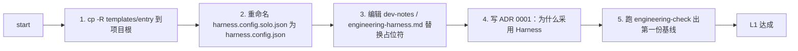

---

## spec_id: harness-spec-mvh
applies_to: [solo, small-team, mid-team, org]
min_level: L1
project_types: [backend-service, library, cli, frontend-spa]

# MVH - Minimum Viable Harness

> 任何项目首日 1 小时内必须先拥有的最小生存核心。MVH ≡ 成熟度 L1。

## 1. 必备 7 文件

```
README.md                                       项目入口
CONTRIBUTING.md                                 协作约定（个人项目可改名为 dev-notes.md）
docs/engineering-harness.md                     项目内 SSOT（≤ 200 行精简版）
docs/adr/0001-engineering-harness-baseline.md  首条 ADR
.github/pull_request_template.md                PR 模板（开源/多机协作时启用）
scripts/engineering-check.{ps1|sh}              本地门禁
verification_baseline.json                      质量基线
harness.config.json                             机器可读契约（最小字段）
```

> 实际文件数为 8（含 `harness.config.json`）。命名上仍称为「7+1 MVH」是因为 `harness.config.json` 是工具消费用，开发者基本不直接读。

## 2. 选配 3 文件

按项目类型增加：


| 文件                    | 适用条件                                |
| --------------------- | ----------------------------------- |
| `docs/perf-budget.md` | 项目类型 = library / cli / frontend-spa |
| `CHANGELOG.md`        | 对外发版（library / cli / 公开 API 服务）     |
| `docs/postmortem/` 目录 | 出现真实事故后才写第一篇                        |


## 3. 完成判定（不达标不进入 L2）

- 7 必备文件全部存在
- `engineering-check` 跑通并输出 PASS/WARN/FAIL 报表
- `harness.config.json` 通过 schema 校验
- 至少 1 条真实 ADR（不是空模板）
- `verification_baseline.json` 已记录首次基线
- PR 模板可被一次真实 PR 实际填写

## 4. 1 小时落地步骤




每一步预计 8-12 分钟，总耗时 ≤ 1 小时。

## 5. 单人模式跳过清单

solo 项目永远不需要：

- On-call / CODEOWNERS / Review SLA
- SLO/SLA/SLI
- Feature Flag 完整策略
- Onboarding 30/60/90
- Post-mortem 文化（出事故才写第一篇）
- DORA 四指标采集
- RFC 流程
- AI Agent 硬留痕字段

如果未来升档，改 `harness.config.json.mode` 即可，不需要补任何文件。

## 6. 升档触发条件


| 条件                  | 应升档到                              |
| ------------------- | --------------------------------- |
| 多于 1 人参与开发          | small-team                        |
| 出现外部消费者 / 公开 API    | small-team（必加 SemVer + CHANGELOG） |
| 出现真实付费用户            | mid-team（必加 SLO + Runbook）        |
| 跨产品线 / 多 SRE / 合规审计 | org                               |


升档动作仅一行：

```json
{ "project": { "mode": "small-team" } }
```

随后按 `[BOOTSTRAP_CHECKLIST.md](BOOTSTRAP_CHECKLIST.md)` 对应段落补齐新增条目。