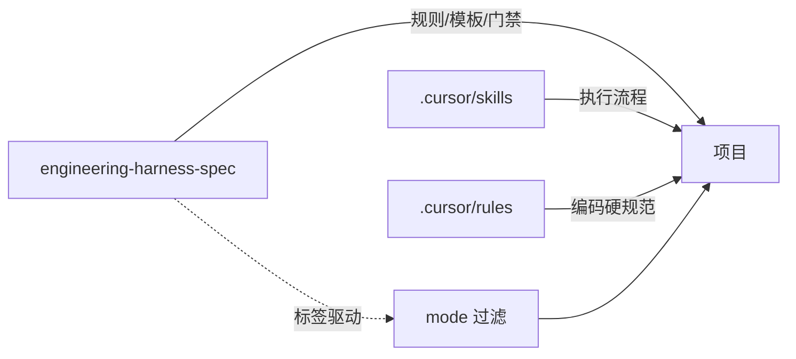
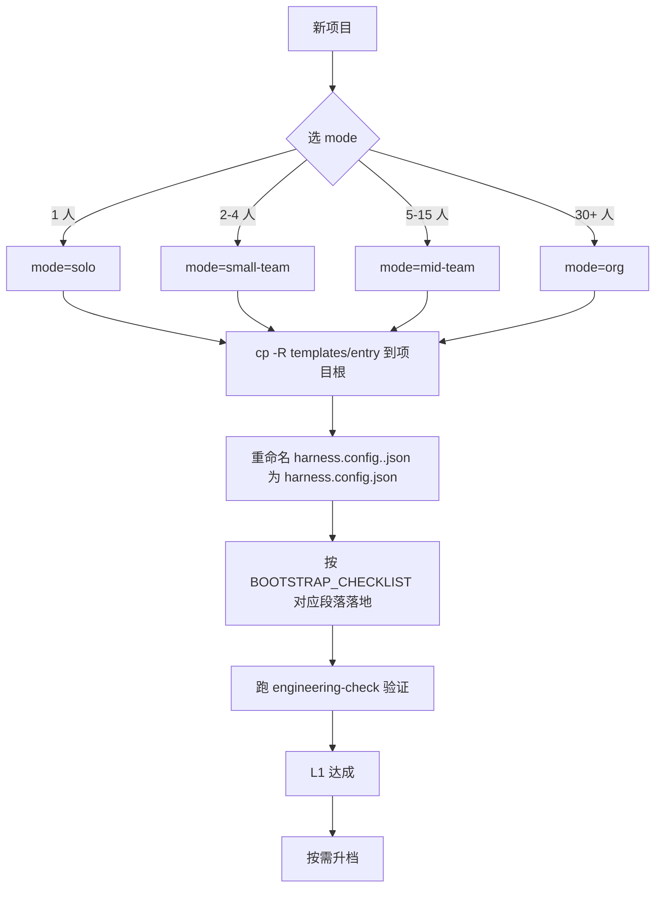

# Engineering Harness Spec

> 跨项目可复用的工程治理规范包。文件全量保留，按 `mode` + 标签按需启用。

本规范覆盖一个软件项目从「需求 -> 设计 -> 编码 -> 测试 -> 评审 -> 发布 -> 运维 -> 复盘」全链路的可工程化条目，被设计为既能服务于一名独立开发者的小项目（约 6k token 装载），也能扩展到 30+ 人组织（约 50k+ token 装载）。

---

## 1. 三十秒入门

1. 选模式：`solo` / `small-team` / `mid-team` / `org`
2. 复制 `templates/entry/harness.config.<mode>.json` 到项目根，重命名为 `harness.config.json`
3. 按 [`BOOTSTRAP_CHECKLIST.md`](BOOTSTRAP_CHECKLIST.md) 对应模式段落落地最小集
4. 后续如有升档诉求，仅改 `harness.config.json.mode` 字段，无需迁移文件

---

## 2. 4 条阅读路径

不同规模的项目按各自路径读取，避免一次装载全部内容。

### 2.1 solo 模式（单人项目）

必读 7 文件，约 ~6k token。覆盖 MVH（最小生存核心）。

| 顺序 | 文件 | 用途 |
| --- | --- | --- |
| 1 | [`MVH.md`](MVH.md) | 7 文件清单 + 1 小时落地 |
| 2 | [`02-process-and-governance.md`](02-process-and-governance.md) §1-§3 | 流程分级 / 一句话两道门最简版 |
| 3 | [`03-quality-and-testing.md`](03-quality-and-testing.md) §1-§4 | 本地门禁 / baseline / 测试金字塔最简版 |
| 4 | [`05-security-and-compliance.md`](05-security-and-compliance.md) §1-§2 | 密钥扫描 / 依赖最低线 |
| 5 | [`06-knowledge-and-memory.md`](06-knowledge-and-memory.md) §1-§2 | ADR 何时写 / features 任务板最简版 |
| 6 | [`ANTIPATTERNS.md`](ANTIPATTERNS.md) | 红线集合（含「小项目套大流程」反模式） |
| 7 | [`templates/entry/`](templates/entry/) | 直接复制即可上手 |

solo 跳过：On-call、CODEOWNERS、Review SLA、SLO/SLA、Feature Flag、DORA、Onboarding、Post-mortem 文化、RFC、AI Agent 硬留痕。

### 2.2 small-team 模式（2-4 人）

solo 必读 + 5 文件，约 ~12k token：

- [`01-people-and-collaboration.md`](01-people-and-collaboration.md) §1-§4（分支 / 提交 / PR / 简化 Code Review）
- [`04-release-and-operations.md`](04-release-and-operations.md) §1-§2（SemVer + CHANGELOG）
- [`templates/governance/`](templates/governance/) feature-stages 01/02/05（轻量版）
- [`templates/knowledge/post-mortem-template.md`](templates/knowledge/post-mortem-template.md)
- [`templates/release/CHANGELOG.md.tmpl`](templates/release/CHANGELOG.md.tmpl)

### 2.3 mid-team 模式（5-15 人产品团队）

small-team 必读 + 15 文件，约 ~25k token：

- 6 模块全文：[`01`](01-people-and-collaboration.md) [`02`](02-process-and-governance.md) [`03`](03-quality-and-testing.md) [`04`](04-release-and-operations.md) [`05`](05-security-and-compliance.md) [`06`](06-knowledge-and-memory.md)
- [`PROJECT_TYPES.md`](PROJECT_TYPES.md) 4 类项目剪裁
- [`MATURITY_LEVELS.md`](MATURITY_LEVELS.md)
- [`AI_AGENT_CONTRACT.md`](AI_AGENT_CONTRACT.md)
- [`STACK_ADAPTERS/`](STACK_ADAPTERS/) 对应栈
- 全部 `templates/` 子目录（按需选用）

### 2.4 org 模式（30+ 人组织 / 多产品）

mid-team 必读 + 全量补强：

- [`DORA.md`](DORA.md) 四指标自证
- [`DEPRECATION_PATH.md`](DEPRECATION_PATH.md) RFC 流程
- [`templates/knowledge/dora-dashboard.md.tmpl`](templates/knowledge/dora-dashboard.md.tmpl)
- 全部 [`templates/`](templates/)

---

## 3. 标签体系

### 3.1 文件级 frontmatter

每个规范文件顶部声明 4 个元字段：

```yaml
---
applies_to: [solo, small-team, mid-team, org]   # 该文件适用的模式集合
min_level: L1                                   # 最低成熟度档（L1/L2/L3/L4）
project_types: [backend-service, library, cli, frontend-spa]  # 默认全部
optional_for: [solo]                            # 该规模下整篇可跳过
---
```

工具读取 `applies_to` / `optional_for` 决定是否在当前 mode 装载该文件。

### 3.2 章节级内联标记

章节标题尾部追加方括号标记：

```markdown
## 3. On-call 轮值 [mid-team+] [solo-skip]
## 4. PR 大小约束 [solo+]
## 5. SLO 定义 [L3+] [project_types: backend-service, frontend-spa]
## 6. RFC 流程 [org-only]
```

| 标签 | 含义 |
| --- | --- |
| `[solo+]` `[small-team+]` `[mid-team+]` | 准入门槛（对应及更高规模适用） |
| `[org-only]` | 仅大组织适用 |
| `[L1+]` `[L2+]` `[L3+]` `[L4+]` | 成熟度门槛 |
| `[solo-skip]` | 强提示单人模式跳过 |
| `[project_types: ...]` | 限定项目类型 |
| `[compliance-driven]` | 仅在合规要求下启用 |
| 无标记 | 默认所有 mode 适用 |

### 3.3 工具消费

- [`scripts/engineering-check.{ps1,sh}.skel`](templates/scripts/) 启动读 `harness.config.json.mode`，跳过不匹配的检查项
- AI Agent / IDE 可按 mode 过滤装载
- CI 工作流按 mode 启停 SCA / SBOM / SLO 上报步骤

---

## 4. 6 模块全景

| # | 模块 | 解决的问题 | 文件 |
| --- | --- | --- | --- |
| 01 | People & Collaboration | 谁评审、谁批准、分支怎么开、PR 多大、On-call 谁顶 | [01](01-people-and-collaboration.md) |
| 02 | Process & Governance | 需求分级、两道门、Gate Review、DoD、紧急通道、ADR | [02](02-process-and-governance.md) |
| 03 | Quality & Testing | 测试金字塔、性能预算、Review checklist、本地/CI 门禁 | [03](03-quality-and-testing.md) |
| 04 | Release & Operations | SemVer、CHANGELOG、灰度、回滚、Feature Flag、SLO、Runbook | [04](04-release-and-operations.md) |
| 05 | Security & Compliance | 依赖扫描、密钥管理、数据分级、审计日志 | [05](05-security-and-compliance.md) |
| 06 | Knowledge & Memory | ADR、features 任务板、Onboarding、Post-mortem | [06](06-knowledge-and-memory.md) |

每个模块文件顶部都给出本模块的 mode 适用矩阵。

---

## 5. 横切补强

| 文件 | 用途 | 适用 |
| --- | --- | --- |
| [`PROJECT_TYPES.md`](PROJECT_TYPES.md) | 4 类项目剪裁矩阵 | mid-team+ |
| [`MATURITY_LEVELS.md`](MATURITY_LEVELS.md) | L1-L4 成熟度分级 | mid-team+ |
| [`MVH.md`](MVH.md) | 最小生存核心 | solo |
| [`DORA.md`](DORA.md) | 四指标自证 | L3+ optional |
| [`AI_AGENT_CONTRACT.md`](AI_AGENT_CONTRACT.md) | AI Agent 协作边界 | small-team+ |
| [`DEPRECATION_PATH.md`](DEPRECATION_PATH.md) | 规范条目废弃 / RFC | mid-team+ |
| [`ANTIPATTERNS.md`](ANTIPATTERNS.md) | 横切红线 | 全员 |
| [`GLOSSARY.md`](GLOSSARY.md) | 术语表 | 全员 |
| [`harness.config.schema.json`](harness.config.schema.json) | 机器可读契约 | 全员 |

---

## 6. 与 .cursor/skills 和 .cursor/rules 的关系



| 角色 | 职责 |
| --- | --- |
| 本规范包 | 定义规则、模板、门禁、回退路由、基线 |
| `.cursor/skills` | 任务执行流程（dev-flow / bugfix-flow / brainstorming 等） |
| `.cursor/rules` | 项目内编码硬规范（API / 数据库 / 日志 / 安全 / 注释） |
| `harness.config.json` | 项目当前模式与基线，驱动工具按 mode 行为 |

互不替代：规范定 What，skills 定 How，rules 定 Code Style。

---

## 7. 一份新项目如何接入



详见 [`BOOTSTRAP_CHECKLIST.md`](BOOTSTRAP_CHECKLIST.md)。

---

## 8. 版本与演进

- 当前规范版本：`v0.1`（首版落地）
- 主版本号在 `harness.config.schema.json` 中维护
- 任何条目修改 / 废弃必须走 [`DEPRECATION_PATH.md`](DEPRECATION_PATH.md) 定义的流程
- 季度复盘：参考 [`02-process-and-governance.md`](02-process-and-governance.md) §10

---

## 9. 不在范围

- 不替代具体语言 / 框架编码规范（那是 `.cursor/rules` 的事）
- 不内置厂商绑定（Vault / Datadog / Sentry 等只在 STACK_ADAPTERS 列举可选项）
- 不发布 npm/pip/maven 包；首版仅文档 + 模板，靠 `cp -R` 复用
- 不覆盖 Mobile / 嵌入式 / 数据科学 / 游戏栈
