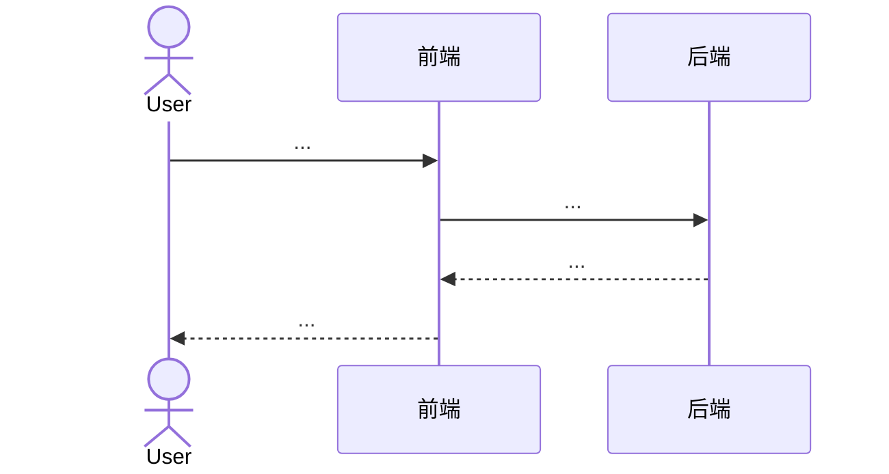

# 01 需求分析

- **任务 ID**：T-XXXX
- **状态**：Draft / Approved / Outdated
- **更新时间**：YYYY-MM-DD
- **负责人**：<姓名>

## 1. 背景与目标

- 业务背景：
- 用户痛点：
- 期望达到的状态（可度量优先）：

## 2. 范围

- 包含：
- 不包含：

## 3. 用户场景与流程

## 4. 歧义点 / 候选方案

| 维度 | 候选解读 | 建议 |
| --- | --- | --- |
| … | A：…  / B：… | 推荐 A，原因：… |

## 5. 验收标准（可测试）

- [ ] …
- [ ] …
- [ ] 单元测试 / 集成测试覆盖关键路径
- [ ] `engineering-check.ps1` 全部 PASS
- [ ] CI 通过

## 6. 历史任务关联

参考 [`.harness/features/INDEX.md`](../INDEX.md) 检索：

| 任务 ID | 名称 | 与本任务的关系 | 关键结论 |
| --- | --- | --- | --- |
| T-XXXX | … | 复用 / 取代 / 共用模块 | … |

## 7. 影响风险（IMPACT_ANALYSIS）

逐项检查：

- [ ] DB 影响（新增 / 改表 / 改索引）
- [ ] 鉴权 / 数据权限 / 租户隔离
- [ ] 接口语义 / 返回结构兼容性
- [ ] 多业务流程 / 多入口
- [ ] 高风险业务（金额 / 订单 / 支付 / 审核）
- [ ] 缓存 / 搜索 / 锁 / 异步
- [ ] 测试覆盖度
- [ ] 文档（Swagger、模块文档）

是否触发升级到完整需求流程：是 / 否

## 8. 工时与排期

- 评估工时：
- 关键里程碑：
