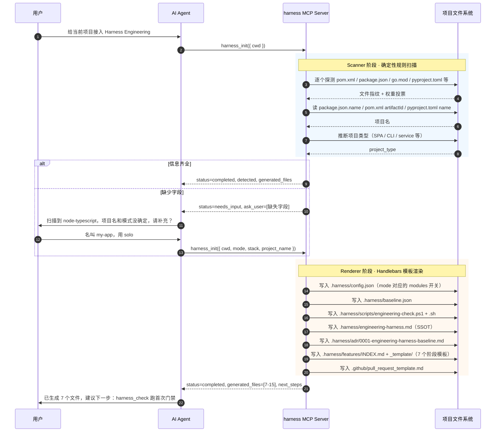
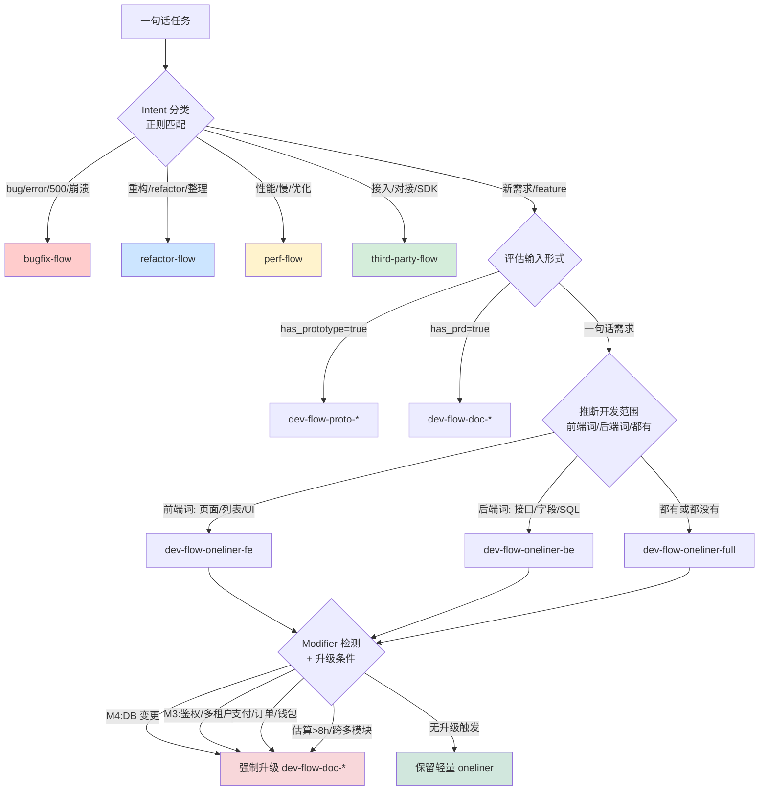
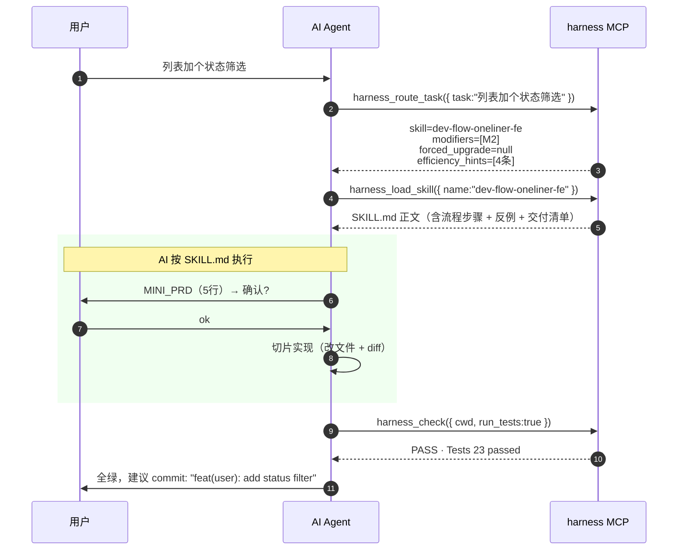
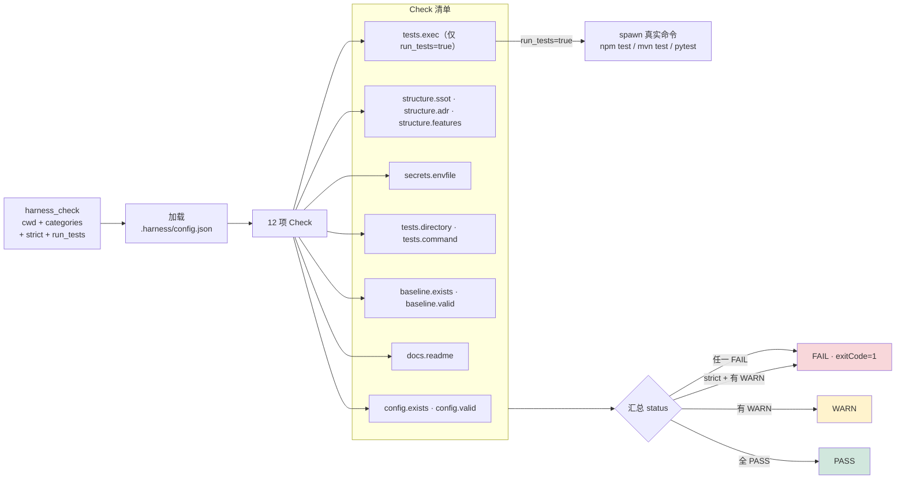
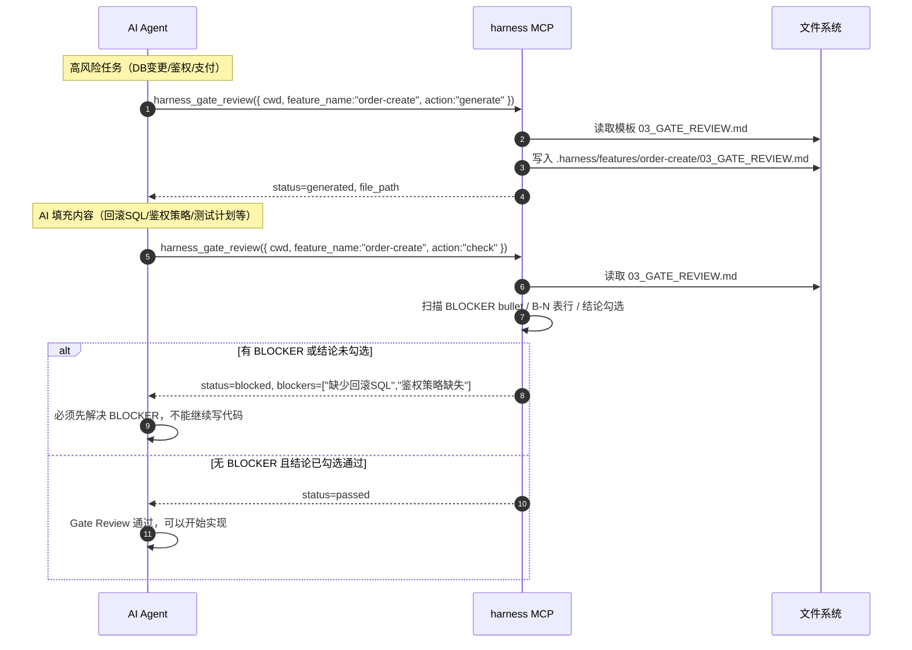
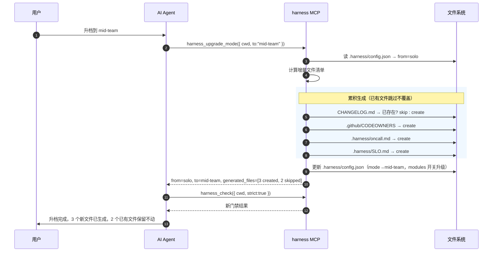
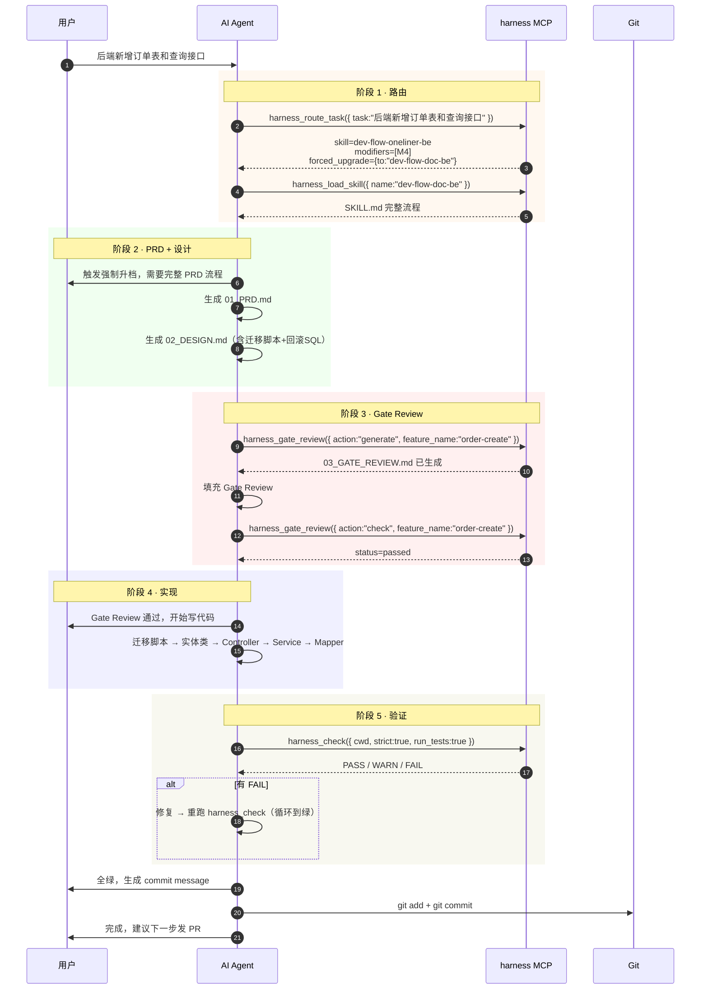
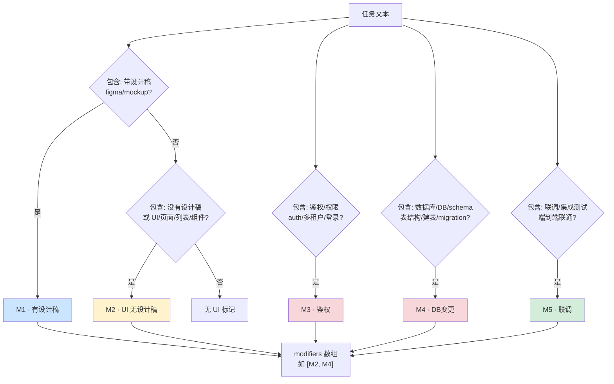
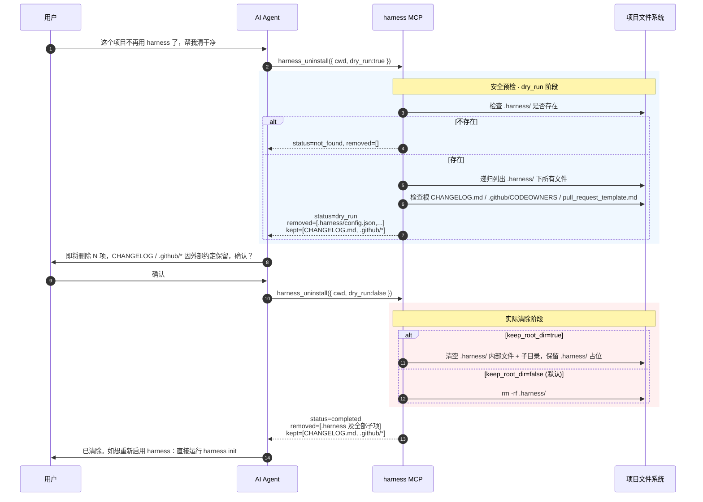

# Harness Engineering MCP · 执行流程图

> 本文档包含 harness-engineering-mcp 全部 7 个 MCP 工具的交互流程图。
> 所有图表使用 Mermaid 格式，可在 GitHub / Cursor / Typora 等支持 Mermaid 的编辑器中直接渲染。

---

## 目录

1. [项目初始化流程（harness_init）](#1-项目初始化流程harness_init)
2. [任务路由决策树（harness_route_task）](#2-任务路由决策树harness_route_task)
3. [日常任务执行时序（route + load_skill + check）](#3-日常任务执行时序)
4. [工程门禁检查（harness_check）](#4-工程门禁检查harness_check)
5. [闸门评审（harness_gate_review）](#5-闸门评审harness_gate_review)
6. [团队升档（harness_upgrade_mode）](#6-团队升档harness_upgrade_mode)
7. [端到端全链路（高风险任务完整流程）](#7-端到端全链路)
8. [Modifier 检测逻辑（M1-M5）](#8-modifier-检测逻辑)
9. [项目卸载（harness_uninstall）](#9-项目卸载harness_uninstall)

---

## 1. 项目初始化流程（harness_init）



### Scanner 文件指纹权重表

| 检测文件 | 识别 stack | 权重 |
|---|---|---|
| `pom.xml` | `java-spring` | 30 |
| `build.gradle(.kts)` | `java-spring` | 25 |
| `package.json` | `node-typescript` | 30 |
| `tsconfig.json` | `node-typescript` | 15 |
| `pyproject.toml` | `python` | 30 |
| `requirements.txt` | `python` | 25 |
| `setup.py` | `python` | 20 |
| `go.mod` | `go` | 35 |

---

## 2. 任务路由决策树（harness_route_task）



### 升级触发条件（从 oneliner 强制升级到 doc 流程）

| 触发条件 | 关键词正则 |
|---|---|
| DB schema 变更 | `数据库/DB/schema/表结构/建表/migration/flyway/liquibase` |
| 鉴权 / 多租户 | `鉴权/权限/auth/租户/多租户` |
| 支付 / 订单 / 钱包 | `支付/订单/钱包/wallet/payment` |
| 工时过大 / 跨多模块 | `>=8h/超过8小时/大改/跨N模块` |

---

## 3. 日常任务执行时序



### 日常 6 回合节拍

| 回合 | 用户说 | AI 自动执行 |
|---|---|---|
| ① 描述需求 | "列表加一个状态筛选" | `harness_route_task` → 路由 |
| ② 确认方向 | "按这个 skill 走" | `harness_load_skill` → 加载 SKILL.md |
| ③ 切片实现 | "ok，开始写代码" | 按 SKILL 切片顺序改文件 |
| ④ 测试 | "跑一下测试" | `harness_check --run-tests` |
| ⑤ 自检 | "提交前体检" | `harness_check --strict` |
| ⑥ 提交 | "可以提交了" | 写 commit message |

---

## 4. 工程门禁检查（harness_check）



### check_id 全集

```
config.exists · config.valid
structure.ssot · structure.adr · structure.features
secrets.envfile
tests.directory · tests.command · tests.exec
baseline.exists · baseline.valid
docs.readme
```

---

## 5. 闸门评审（harness_gate_review）



### Gate Review 通过条件

1. 文件中无 BLOCKER bullet 且无 B-N 表行
2. 结论一节的 `[x] 通过` 已勾选

两个条件**同时满足**才返回 `status=passed`。

---

## 6. 团队升档（harness_upgrade_mode）



### 升档累积生成文件清单

| 目标 mode | 新增文件 |
|---|---|
| `small-team` | `CHANGELOG.md` · `.github/pull_request_template.md` |
| `mid-team` | `.github/CODEOWNERS` · `.harness/oncall.md` · `.harness/SLO.md` |
| `org` | `.harness/DORA.md` · `.harness/rfc/0000-template.md` · `.harness/SBOM.md` · `.harness/compliance/.gitkeep` |

---

## 7. 端到端全链路

> 以高风险任务"后端新增订单表和查询接口"为例，展示从路由到提交的完整流程。



---

## 8. Modifier 检测逻辑



### Modifier 含义速查

| 标签 | 含义 | 触发关键词 |
|---|---|---|
| M1 | 有设计稿 | `带设计稿` `figma` `mockup` `视觉稿` |
| M2 | UI / 无设计稿 | `没有设计稿` `UI` `页面` `列表` `组件` |
| M3 | 鉴权 / 多租户 | `鉴权` `权限` `auth` `登录` `多租户` |
| M4 | DB schema 变更 | `数据库` `schema` `新增…表` `migration` |
| M5 | 联调 / 端到端 | `只联调` `联调` `集成测试` `端到端联通` |

---

## 9. 项目卸载（harness_uninstall）



### Uninstall 设计要点

| 维度 | 行为 |
|---|---|
| 默认范围 | 递归删除 `.harness/` 目录树 |
| 自动保留 | `CHANGELOG.md` / `.github/CODEOWNERS` / `.github/pull_request_template.md` |
| 保留原因 | npm release / GitHub 平台等**外部工具约定**这些位置 |
| 提示用户 | 上述保留项列在 `kept[]` 数组里，用户决定是否手工删 |
| 安全门 | CLI 默认弹交互确认，`-y` 跳过；MCP 工具调用 `dry_run=true` 预览 |
| 重装能力 | uninstall 后直接 `harness init` 即可重新启用 |

---

> 本文档由 harness-engineering-mcp 项目维护，配套阅读：
> - [`README.md`](../README.md) — 全局概览
> - [`IDE_DAILY_USAGE.md`](IDE_DAILY_USAGE.md) — 装好后每天怎么用
> - [`PROPOSAL.md`](PROPOSAL.md) — v0.1 设计草案（含原始时序图）
