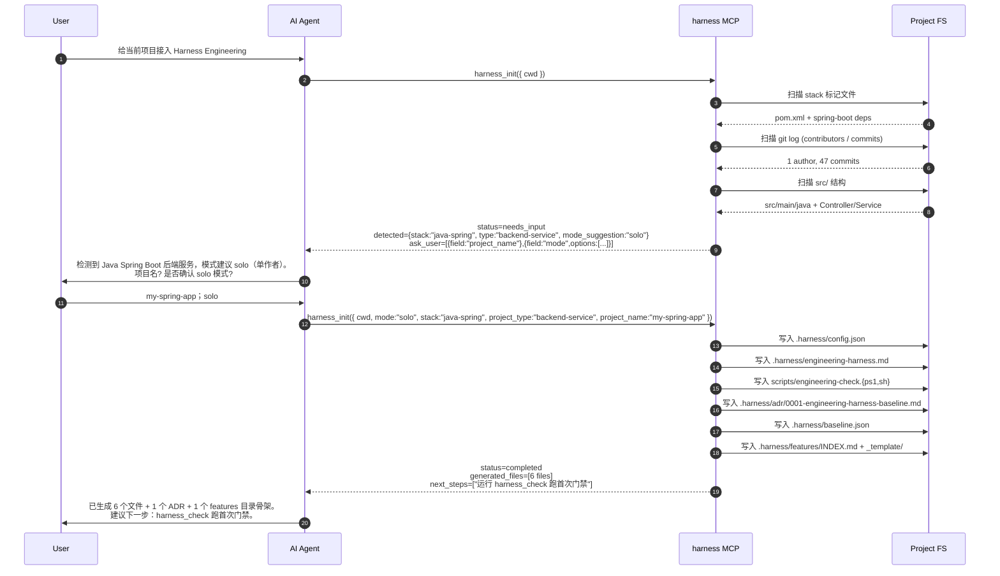
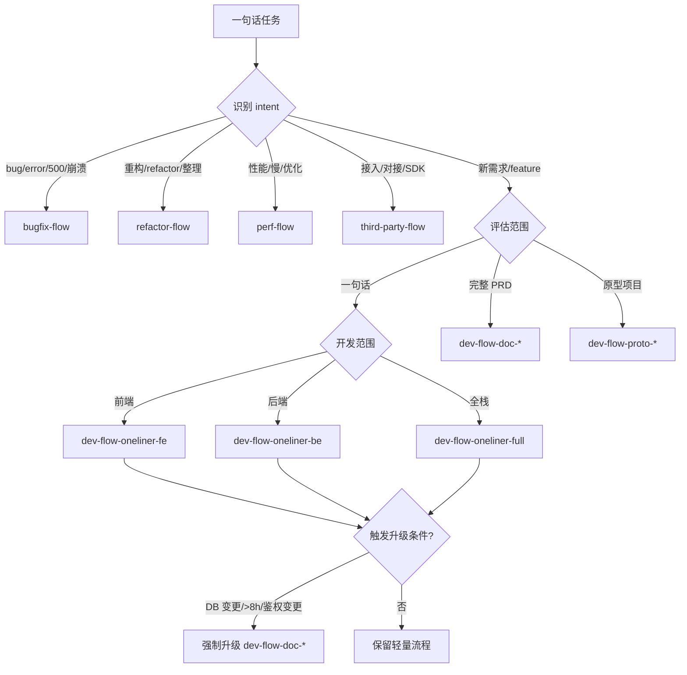

# Harness Engineering MCP · 方案设计文档（v0.1 草案）

> 临时位置：本文件落在 `Restful-all/docs/harness-mcp/` 仅为设计阶段过渡，最终会迁移到独立仓库（位置待用户拍板）。
>
> 参考源：`C:\lcc\workspace\heritage-inherit` 的 Engineering Harness 体系。
>
> 三个已拍板的决策：**TypeScript/Node** + **MCP 实时供给** + **扫描预填 + 问答补漏**。

---

## 1. MINI_PRD

### 1.1 目标（What）

把 `heritage-inherit` 项目里已经成熟的 Engineering Harness（SSOT 文档 + Skills 体系 + .cursor/rules + engineering-check.ps1 + features/任务记忆 + Bootstrap 流程 + .harness/baseline.json）打包成一个 **MCP server**，让任何 IDE / AI 工具（Claude Code / Cursor / Codex / Cline / Windsurf 等）能够：

1. 通过一行 MCP 配置即接入完整的工程治理能力；
2. 通过 `harness_init` 工具一键扫描项目并生成项目个性化部分；
3. 通过 MCP 资源实时拉取最新的 spec / skills / rules，无需复制到项目本地；
4. 通过 `harness_check` 跨平台执行工程门禁（替代 ps1 脚本）。

### 1.2 非目标（Won't Do）

- 不替代 IDE 自身的规则系统（Cursor `.cursor/rules` / Claude `AGENTS.md` 仍归用户管理）；
- 不绑定特定云服务 / 厂商（Datadog / Vault / Sentry 等仅作为 stack adapter 中的可选项）；
- 不包含业务代码示例；
- 不试图覆盖移动 / 嵌入式 / 游戏 / 数据科学栈（首版只覆盖 backend-service / library / cli / frontend-spa 四类）；
- 不强制要求项目接入全部模块（按 mode 过滤）。

### 1.3 Success Metrics

| 指标 | 目标值 |
|---|---|
| 新项目从零接入耗时 | ≤ 5 分钟（`npx harness init` + 3-5 个问答） |
| spec 升级时项目迁移成本 | 0（重新 `harness upgrade` 一次） |
| 单次 `harness_check` 执行时间 | ≤ 3 秒（不含子命令如 `mvn test`） |
| 支持 IDE 数量（v0.1） | ≥ 3（Cursor / Claude Code / Codex CLI） |
| 内置 skills 数量 | ≥ 18（dev-flow* 13 + bugfix / refactor / perf / third-party / brainstorming） |

### 1.4 用户旅程

```
M0: 任何 IDE 中安装 MCP server（一次性，跨项目）
    → 在 ~/.cursor/mcp.json 或 ~/.claude/mcp.json 加一行
    → 重启 IDE，即可调用 harness_* 全部工具

M1: 接到一个新项目，开始 init
    → 用户对 AI 说："给项目接入 Harness Engineering"
    → AI 调 harness_init({cwd: ...})
    → MCP 扫描 pom.xml / package.json / requirements.txt → 预填 stack / type
    → MCP 通过返回值 ask_user_questions 字段让 AI 追问 mode / project_name 等
    → AI 收齐答案后再调 harness_init({...完整参数})
    → MCP 渲染并写入：.harness/config.json / .harness/engineering-harness.md / scripts/engineering-check.* / .harness/adr/0001-baseline.md / .harness/baseline.json
    → 用户 5 分钟内拿到完整的 Harness 接入

M2: 日常使用
    → 一句话需求 → AI 调 harness_route_task → 返回推荐 skill + 产物清单
    → AI 调 harness_load_skill 加载 skill 正文 → 按 skill 执行
    → 完成前 → 调 harness_check 跑门禁
    → Gate Review 触发 → harness_gate_review 生成评审入口

M3: spec 升级
    → npm update -g harness-engineering-mcp
    → 在项目里 harness_upgrade_mode 同步基线（如有新增检查项）
    → 项目零迁移，自动获得新规则
```

---

## 2. MCP API_CONTRACT（v0.1）

### 2.1 工具清单

```typescript
// ───────────────────────────────────────────────────────────────
// Tool 1: harness_init
// 用途：扫描项目并生成 Harness 个性化文件
// ───────────────────────────────────────────────────────────────
{
  name: "harness_init",
  description: "Initialize Engineering Harness in a project. Scans project files (pom.xml, package.json, requirements.txt, Cargo.toml, go.mod) and git history to pre-fill stack/type/mode. Missing fields are returned via ask_user list so the AI can question the user.",
  inputSchema: {
    type: "object",
    properties: {
      cwd: { type: "string", description: "Absolute project root path" },
      mode: { type: "string", enum: ["solo", "small-team", "mid-team", "org"] },
      stack: { type: "string", enum: ["java-spring", "node-typescript", "python", "go", "other"] },
      project_type: { type: "string", enum: ["backend-service", "library", "cli", "frontend-spa"] },
      project_name: { type: "string" },
      ide: { type: "string", enum: ["cursor", "claude-code", "codex", "windsurf", "cline", "auto"], default: "auto" },
      maturity_target: { type: "string", enum: ["L1", "L2", "L3", "L4"], default: "L1" },
      compliance: { type: "array", items: { enum: ["gdpr", "pipl", "iso27001", "soc2", "hipaa"] } },
      dry_run: { type: "boolean", default: false }
    },
    required: ["cwd"]
  }
}
// Returns: {
//   status: "ready" | "needs_input" | "completed" | "dry_run",
//   detected: { stack, project_type, mode_suggestion, project_name, evidence: [...] },
//   ask_user: [{ field: "mode", question: "团队规模？", options: [...] }],   // 仅 status==needs_input 时返回
//   generated_files: [{ path, action: "created"|"updated"|"skipped", bytes }],
//   next_steps: ["运行 harness_check 校验首次门禁", ...]
// }

// ───────────────────────────────────────────────────────────────
// Tool 2: harness_check
// 用途：跨平台工程门禁（替代 engineering-check.ps1）
// ───────────────────────────────────────────────────────────────
{
  name: "harness_check",
  description: "Run Engineering Harness checks based on .harness/config.json. Cross-platform replacement for engineering-check.ps1/sh. Returns structured PASS/WARN/FAIL.",
  inputSchema: {
    type: "object",
    properties: {
      cwd: { type: "string" },
      categories: {
        type: "array",
        items: { enum: ["config", "structure", "tests", "secrets", "baseline", "docs", "all"] },
        default: ["all"]
      },
      strict: { type: "boolean", default: false, description: "WARN 也视为 FAIL" },
      output_format: { type: "string", enum: ["summary", "detailed", "json"], default: "summary" }
    },
    required: ["cwd"]
  }
}
// Returns: {
//   status: "PASS" | "WARN" | "FAIL",
//   summary: { pass: 12, warn: 3, fail: 0, total: 15 },
//   results: [{ category, check_id, status, message, suggestion?, file?, line? }],
//   baseline_diff: { added_tests: 3, coverage_change: "+0.5%" },
//   elapsed_ms: 1842
// }

// ───────────────────────────────────────────────────────────────
// Tool 3: harness_route_task
// 用途：输入一句话需求，返回推荐的 skill + 产物清单
// ───────────────────────────────────────────────────────────────
{
  name: "harness_route_task",
  description: "Route a user task description to the appropriate skill workflow. Returns skill name, deliverable checklist, and whether a forced upgrade is needed (>8h estimated, DB change, etc).",
  inputSchema: {
    type: "object",
    properties: {
      task: { type: "string", description: "One-line user request, e.g. '列表加个状态筛选'" },
      cwd: { type: "string" },
      context: { type: "object", description: "Optional hints: { scope?, has_prd?, has_prototype? }" }
    },
    required: ["task"]
  }
}
// Returns: {
//   skill: "dev-flow-oneliner-fe",
//   skill_uri: "harness://skills/dev-flow-oneliner-fe",
//   weight: "一句话小需求",
//   deliverables: ["MINI_PRD", "IMPACT_ANALYSIS", "API_CONTRACT(if needed)"],
//   forced_upgrade: null,                                  // 或 { to: "dev-flow-doc-fe", reason: "估算 > 8h" }
//   suggested_next_tools: ["harness_load_skill", "harness_check"]
// }

// ───────────────────────────────────────────────────────────────
// Tool 4: harness_load_skill
// 用途：按名加载内置 skill 正文（AI 后续按 skill 内容执行）
// ───────────────────────────────────────────────────────────────
{
  name: "harness_load_skill",
  description: "Load the full markdown content of a built-in skill. AI should follow the skill instructions after loading.",
  inputSchema: {
    type: "object",
    properties: {
      name: { type: "string", description: "Skill name, e.g. 'dev-flow' / 'bugfix-flow' / 'brainstorming'" }
    },
    required: ["name"]
  }
}
// Returns: {
//   name, version, content, depends_on: ["brainstorming"], related: ["dev-flow-doc-fe", "dev-flow-doc-be"]
// }

// ───────────────────────────────────────────────────────────────
// Tool 5: harness_gate_review
// 用途：触发 / 生成 Gate Review 文档骨架
// ───────────────────────────────────────────────────────────────
{
  name: "harness_gate_review",
  description: "Generate or check 03_GATE_REVIEW.md for a feature. Returns review entry, blocker list, and pass/fail criteria.",
  inputSchema: {
    type: "object",
    properties: {
      cwd: { type: "string" },
      feature_name: { type: "string" },
      action: { type: "string", enum: ["generate", "check"], default: "generate" }
    },
    required: ["cwd", "feature_name"]
  }
}

// ───────────────────────────────────────────────────────────────
// Tool 6: harness_upgrade_mode
// 用途：从 solo 升档到 small-team / mid-team / org
// ───────────────────────────────────────────────────────────────
{
  name: "harness_upgrade_mode",
  description: "Upgrade harness mode (solo→small-team→mid-team→org) with zero migration cost. Generates additional files required by the new mode.",
  inputSchema: {
    type: "object",
    properties: {
      cwd: { type: "string" },
      from: { type: "string", enum: ["solo", "small-team", "mid-team"] },
      to: { type: "string", enum: ["small-team", "mid-team", "org"] }
    },
    required: ["cwd", "to"]
  }
}
```

### 2.2 资源清单（MCP Resources）

```
URI                                         描述
─────────────────────────────────────────  ────────────────────────────────
harness://spec/index                       全 spec 文件清单 + frontmatter
harness://spec/<mode>                      按 mode 过滤后的 spec 文件清单
harness://spec/file/<filename>             单 spec 文件正文（如 02-process.md）
harness://skills/index                     skills 全集索引（含 frontmatter）
harness://skills/<name>                    skill 正文
harness://rules/index                      rules 全集索引
harness://rules/<id>                       单条 .cursor/rules 模板
harness://templates/index                  模板清单
harness://templates/<path>                 单模板文件正文
harness://config/schema                    harness.config.schema.json
harness://stack-adapters/<stack>           stack adapter（java-spring 等）
```

### 2.3 CLI 命令（与 MCP 工具一一对应）

```bash
# 安装
npm i -g harness-engineering-mcp

# 项目初始化（也支持 npx）
harness init                  # 交互式
harness init --mode=solo --stack=java-spring --type=backend-service --name=my-proj
npx -y -p harness-engineering-mcp@latest harness init   # 不全局安装（包名 ≠ bin 名，必须用 -p 写法）

# 跑门禁
harness check
harness check --strict --categories=tests,secrets
harness check --output-format=json

# 升档
harness upgrade --to=small-team

# 列出 skills / spec
harness list skills
harness list spec --mode=solo

# 启动 MCP server（IDE 自动拉起，一般不需手动跑）
harness mcp
```

---

## 3. 项目脚手架

```
harness-engineering-mcp/
├── package.json                # name: harness-engineering-mcp, bin: harness
├── tsconfig.json
├── README.md
├── CHANGELOG.md
├── LICENSE                     # MIT
├── .npmignore
├── src/
│   ├── index.ts                # 双入口：检测 argv，分发到 MCP server 或 CLI
│   ├── cli/
│   │   ├── index.ts            # commander 注册命令
│   │   ├── commands/
│   │   │   ├── init.ts
│   │   │   ├── check.ts
│   │   │   ├── upgrade.ts
│   │   │   ├── list.ts
│   │   │   └── mcp.ts
│   │   └── prompts/
│   │       └── inquire.ts      # inquirer / prompts 交互
│   ├── mcp/
│   │   ├── server.ts           # @modelcontextprotocol/sdk Server 实例
│   │   ├── tools/
│   │   │   ├── init.ts
│   │   │   ├── check.ts
│   │   │   ├── route.ts
│   │   │   ├── load-skill.ts
│   │   │   ├── gate-review.ts
│   │   │   └── upgrade.ts
│   │   └── resources/
│   │       ├── spec.ts
│   │       ├── skills.ts
│   │       ├── rules.ts
│   │       └── templates.ts
│   ├── core/
│   │   ├── scanner/
│   │   │   ├── stack-detector.ts     # 看 pom.xml/package.json/...
│   │   │   ├── type-detector.ts      # 看 src 结构、是否 dist、是否 main
│   │   │   ├── mode-suggester.ts     # 看 git log / contributors 数
│   │   │   └── index.ts
│   │   ├── renderer/
│   │   │   ├── handlebars.ts         # 模板引擎
│   │   │   ├── render-config.ts      # .harness/config.json
│   │   │   ├── render-ssot.ts        # .harness/engineering-harness.md
│   │   │   └── render-features.ts    # .harness/features/_template
│   │   ├── router/
│   │   │   ├── intent-classifier.ts  # 一句话 → intent (bugfix/refactor/...)
│   │   │   ├── weight-estimator.ts   # 估算工时 / 范围
│   │   │   └── skill-mapper.ts       # intent + weight → skill
│   │   ├── checker/
│   │   │   ├── config-check.ts
│   │   │   ├── structure-check.ts
│   │   │   ├── secrets-check.ts
│   │   │   ├── tests-check.ts
│   │   │   ├── baseline-check.ts
│   │   │   └── runner.ts             # 编排 + 输出
│   │   ├── config/
│   │   │   ├── loader.ts             # 读 .harness/config.json + 校验 schema
│   │   │   └── defaults.ts
│   │   └── ide-adapter/
│   │       ├── cursor.ts             # 检测 .cursor/ 并生成对应文件
│   │       ├── claude-code.ts        # 检测 .claude/ 或 AGENTS.md
│   │       ├── codex.ts
│   │       └── index.ts
│   └── types/
│       ├── harness.ts                # 共享类型（含 .harness/config.json TS 类型）
│       └── mcp.ts
├── assets/                          # 不参与编译，运行时按需读
│   ├── spec/                        # 复制自 heritage-inherit/docs/engineering-harness-spec/
│   │   ├── 01-people-and-collaboration.md
│   │   ├── ...
│   │   ├── harness.config.schema.json
│   │   └── STACK_ADAPTERS/
│   ├── skills/                      # 复制自 ~/.cursor/skills/  + 用户的本地 skills/ 合并
│   │   ├── dev-flow/SKILL.md
│   │   ├── dev-flow-doc-fe/SKILL.md
│   │   ├── ...（共 ≥ 18 个）
│   │   └── _index.json              # 自动生成的索引
│   ├── rules/                       # 复制自 heritage-inherit/.cursor/rules/
│   │   ├── 01-post-coding-doc-generation.mdc
│   │   └── ...
│   ├── templates/
│   │   ├── entry/
│   │   │   ├── harness.config.solo.json
│   │   │   ├── harness.config.small-team.json
│   │   │   ├── harness.config.mid-team.json
│   │   │   ├── harness.config.org.json
│   │   │   ├── README.md.hbs
│   │   │   ├── engineering-harness.md.hbs
│   │   │   └── engineering-check.{ps1,sh}.hbs
│   │   ├── features/_template/
│   │   │   ├── 01_REQUIREMENT_ANALYSIS.md.hbs
│   │   │   ├── ... (02-06)
│   │   ├── adr/
│   │   │   └── 0001-engineering-harness-baseline.md.hbs
│   │   └── pr/
│   │       └── pull_request_template.md.hbs
│   └── stack-adapters/
│       ├── java-spring.md
│       ├── node-typescript.md
│       ├── python.md
│       └── go.md
├── test/
│   ├── fixtures/                    # 假项目（pom.xml only / package.json only / ...）
│   ├── scanner.test.ts
│   ├── renderer.test.ts
│   ├── checker.test.ts
│   ├── router.test.ts
│   └── e2e/
│       ├── init-java-spring.test.ts
│       ├── init-node-ts.test.ts
│       └── mcp-server.test.ts
└── dist/                            # tsc 输出，发布产物
```

**关键依赖**：

| 依赖 | 用途 |
|---|---|
| `@modelcontextprotocol/sdk` | MCP server / client |
| `commander` | CLI 命令解析 |
| `prompts` 或 `inquirer` | 交互式 init |
| `handlebars` 或 `mustache` | 模板渲染 |
| `ajv` | .harness/config.json schema 校验 |
| `globby` | 文件扫描 |
| `simple-git` | git log / contributors 分析 |
| `picocolors` | 终端着色 |
| `vitest` | 单测 |
| `tsup` | 打包编译 |

---

## 4. init 流程时序图



---

## 5. 任务路由器逻辑（harness_route_task）



**升级触发条件**（从 `dev-flow-oneliner-*` 强制升级）：
- 估算工时 > 8h
- 涉及 DB schema 变更
- 涉及鉴权 / 多租户隔离
- 涉及支付 / 订单 / 钱包
- 涉及多模块联动 ≥ 3 个

---

## 6. 4 周 milestone

| 周次 | 阶段 | 交付物 | DoD |
|---|---|---|---|
| 第 1 周 | M1 骨架 + assets | 项目脚手架 + MCP server hello + assets/ 全量导入（spec 17 + skills 18 + rules 15 + templates） | `npm test` 跑通 hello；MCP server 能在 Cursor 中被识别（无工具调用） |
| 第 2 周 | M2 init + check | `harness_init` 完整实现 + scanner / renderer / template；`harness_check` 跨平台版本 + CLI 包装 + 单测覆盖率 ≥ 70% | 在 3 个 fixture 项目（Java Spring / Node TS / Python）跑通 init；check 输出 PASS/WARN/FAIL 与 ps1 一致 |
| 第 3 周 | M3 router + resources | `harness_route_task`（含 intent 分类 + 升级触发）+ `harness_load_skill`；4 类 MCP 资源（spec/skills/rules/templates）暴露；Cursor 联调 | 在真实项目中跑 8 个典型任务路由全部命中正确 skill；Cursor 通过资源 URI 读取 skill 内容 |
| 第 4 周 | M4 gate + 多 IDE | `harness_gate_review` + `harness_upgrade_mode`；Claude Code / Codex CLI 联调；README + 安装文档；v0.1.0 发布到 npm | 3 个 IDE 都能调用全部 6 个工具；从零到完整接入新项目 ≤ 5 分钟 |
| 第 5 周（v0.2） | 目录收拢 + uninstall | `.harness/` 统一目录 + 第 7 个工具 `harness_uninstall` + `harness_init --force`；v0.2.0 发布 | 全部 7 工具可用；老项目 git mv 升级路径清晰；69 测试用例全绿 |

---

## 7. 风险与缓解

| 风险 | 影响 | 缓解 |
|---|---|---|
| MCP SDK 跨 IDE 行为差异（资源/工具支持度） | 中 | 第 1 周做 3 IDE 兼容性矩阵，差异点用工具兜底替代资源 |
| 内置 skills 与项目本地 skills 命名冲突 | 中 | 资源 URI 加 `harness://` 前缀避免冲突；CLI 提供 `--prefer-local` |
| ps1 行为难以 100% 跨平台等价 | 低 | 在 v0.1 标注「ps1 仍可用作 fallback」；v0.2 再追平 |
| init 误判 stack（如 monorepo 同时有 pom + package.json） | 中 | 扫描器返回 detected 时一并返回 confidence + evidence；冲突时强制 ask_user |
| 用户对 skill 内容有定制需求 | 中 | 提供 `harness_load_skill --override-from=<path>` 让本地优先 |

---

## 8. 下一步决策项（请用户拍板）

| # | 决策项 | 推荐 |
|---|---|---|
| **D4** | 仓库位置：A) `C:\lcc\workspace\harness-engineering-mcp` 新仓库；B) 当前 Restful-all 仓库的子目录；C) Github 公开仓库直接起 | A（推荐，纯净，便于发 npm） |
| **D5** | 包名：A) `harness-engineering-mcp`；B) `@<scope>/harness-mcp`（需要 npm 账号 scope）；C) `engineering-harness-mcp` | A（无 scope，最快发布） |
| **D6** | 第 1 周交付节奏：A) 一次性把第 1 周全做完再 review；B) 每完成一个里程碑（脚手架 → MCP hello → assets 导入）就 review；C) 边写边 review | B（推荐，避免回头返工） |
| **D7** | 是否要 Github CI（GitHub Actions）：A) v0.1 就上 CI；B) v0.2 再说 | A（推荐，第 1 周就配置好） |

---

> 本文档为 v0.1 草案。用户拍板 D4-D7 后会即刻开始 M1 实施，并将本文件迁移到最终仓库根目录的 `docs/PROPOSAL.md`。
